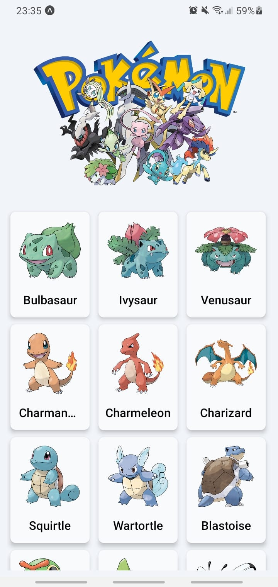
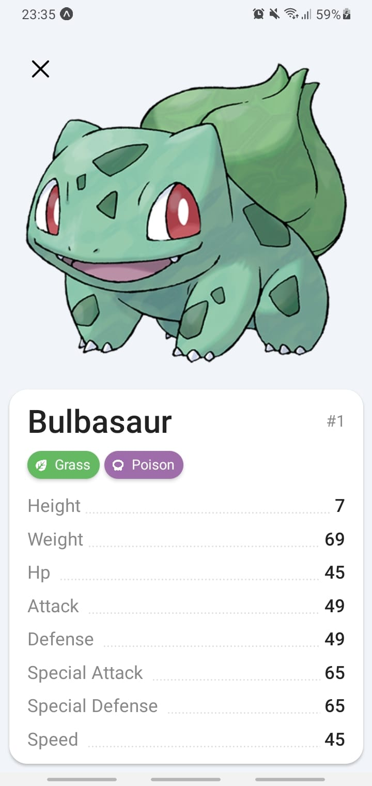

# React Native Shared Element Transition - Pokédex

## ⭐ Give this repository a star! ⭐

This is a simple React Native App to demonstrate how Shared Elements transition works using Navigation.

I've utilized the [Pokémon API](https://pokeapi.co) to fetch and show some cute little creatures.

Also, to make it ⚡ <b style="color: #8b5cf6">blazing fast</b> ⚡ to show and scroll through the pokémon list, I've used [FlashList](https://shopify.github.io/flash-list/docs/), which is a modern and optimized way to create lists in React Native.

<div style="display:flex;">



</div>

### Install dependencies

This React App was created using Expo-cli, therefore, you need to install it before opening the project.

1. Install expo-cli

```bash
npm i -g expo-cli
```

2. Open your command prompt and navigate to the project folder.

3. Install the dependencies:

```bash
npm install
```
or
```bash
yarn
```

### Run the app

After installing all the dependencies, start the project using the command:

```bash
npm start
```
ou
```bash
yarn start
```

### Contribution and help

You can fork and make contributions as you like.

Feel free to open an issue to ask or seek for help if needed.

Give a ⭐ if you like it!